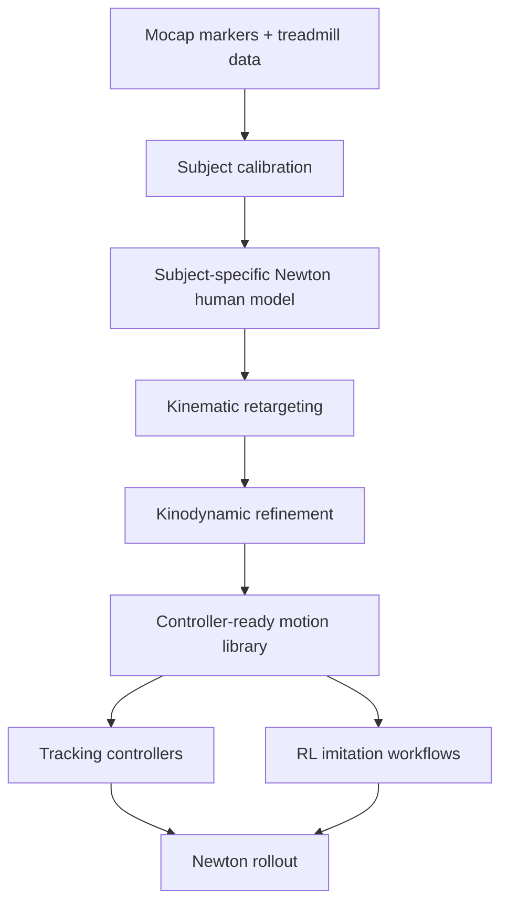

# Kinodynamic Human Retargeting with Newton

## Goal

Build a kinodynamic human retargeting system for creating digital twins of real humans running on an instrumented treadmill captured by motion capture. The system should convert raw mocap and treadmill measurements into physically plausible, controller-ready motion data that can be used in ProtoMotions-style controllers, imitation learning, and RL workflows.

The core idea is to use Newton as the physics backend for retargeting, validation, rollout, and eventually batched policy training.

## System Overview



The pipeline should produce both visually accurate and dynamically feasible human motion:

- `q_t`: generalized pose
- `qd_t`: generalized velocity
- `u_t`: torque, PD target, or residual control action
- `contact_t`: foot contact state
- `grf_t`: measured and/or simulated ground reaction forces
- `obs_t`: controller/RL observations

## Why Newton

Newton is a good fit because it provides:

- articulated rigid-body simulation
- GPU/Warp-oriented workflows
- FK/IK utilities
- contact generation and contact data
- `ModelBuilder`, `Model`, `State`, `Control`, and solver abstractions
- multi-world and batched-control patterns useful for RL
- `ArticulationView` for batched articulation inspection/control
- Newton/MuJoCo/USD integration paths for model import and interoperability

Important Newton concepts for this project:

- `newton.ModelBuilder`: construct the human model, collision shapes, joints, and actuators
- `newton.Model`: finalized simulation model
- `newton.State`: stores `joint_q`, `joint_qd`, body poses, and velocities
- `newton.Control`: stores joint torques, target positions, target velocities, and actuator inputs
- `newton.Contacts`: contact points, normals, forces, and related contact information
- `newton.eval_fk`: forward kinematics
- `newton.eval_ik` / `newton.ik`: inverse kinematics and objective-based fitting
- `newton.selection.ArticulationView`: RL-style batched articulation access

## Digital Twin Model

Each subject should have a calibrated Newton humanoid model.

### Geometry

Estimate subject-specific morphology from calibration data:

- pelvis/root frame
- spine/torso segment lengths
- hip, knee, ankle, shoulder, elbow, wrist joint centers
- segment lengths
- foot length, width, toe position, heel position
- marker attachment locations relative to body segments
- collision capsules/boxes for limbs
- detailed foot contact geometry

### Inertial Properties

Initial estimates can come from anthropometric tables:

- total subject mass
- segment mass fractions
- center-of-mass locations
- segment inertias

These should later be refined using treadmill force data.

### Joints

Start with a practical articulated model:

- floating root/pelvis
- hips: 3 DOF each
- knees: 1 DOF each
- ankles: 2-3 DOF each
- toes: optional hinge joints
- spine: reduced DOF
- shoulders/elbows/wrists: optional for MVP, important later for full-body imitation

### Actuation

Support multiple action/control modes:

1. **Torque control**
   - policy/action writes joint torques into `Control.joint_f`

2. **PD target control**
   - policy/action writes target positions into `Control.joint_target_q`
   - optionally writes target velocities into `Control.joint_target_qd`

3. **Residual target control**
   - policy/action predicts residuals around a reference pose
   - common for imitation/RL workflows

For the first implementation, prefer PD target or residual target control. It is usually easier to stabilize than direct torque control.

## Input Data

Expected inputs:

- mocap marker trajectories
- subject calibration trial
- treadmill belt speed over time
- measured treadmill forces and moments, if available
- optional force plate center of pressure
- optional event labels such as heel strike/toe off

The instrumented treadmill data is valuable for disambiguating running contacts and tuning physical parameters.

## Retargeting Pipeline

### Stage 1: Subject Calibration

Build a subject-specific body model and marker map.

Inputs:

- static pose markers
- functional calibration trials, if available
- subject height/mass
- marker labels

Outputs:

- Newton humanoid morphology
- marker-site attachments
- joint center estimates
- segment lengths
- initial mass/inertia parameters

Marker sites should be attached to body segments rather than treating mocap markers as joint centers.

### Stage 2: Kinematic Retargeting

Fit the Newton humanoid to the mocap markers without requiring full dynamic consistency.

Objective:

```text
minimize marker position error
       + joint limit violations
       + pose smoothness
       + anatomical priors
       + root trajectory regularization
```

Outputs:

```text
q_kin[t]
qd_kin[t]
marker_error[t]
```

Newton tools likely useful here:

- `newton.eval_fk`
- `newton.eval_ik`
- `newton.ik.IKObjectivePosition`
- `newton.ik.IKObjectiveRotation`
- `newton.ik.IKObjectiveJointLimit`
- `ArticulationView.eval_fk`

This stage should prioritize marker fidelity and anatomical plausibility, but the result may still be dynamically infeasible.

### Stage 3: Kinodynamic Refinement

Refine the kinematic motion using Newton simulation and treadmill/contact constraints.

Objective:

```text
minimize marker tracking error
       + joint pose tracking error
       + velocity tracking error
       + acceleration smoothness
       + torque regularization
       + foot slip relative to treadmill belt
       + foot penetration
       + contact timing mismatch
       + GRF mismatch against measured treadmill forces
       + center-of-mass consistency
```

Outputs:

```text
q_dyn[t]
qd_dyn[t]
action_or_target[t]
contact_state[t]
grf_sim[t]
tracking_metrics[t]
```

The dynamically refined motion is the version that should be used for controller training and RL.

### Stage 4: Motion Library Export

Export controller-ready motion clips in a format compatible with ProtoMotions-style workflows.

Each clip should include:

- root position
- root orientation
- root linear velocity
- root angular velocity
- joint positions
- joint velocities
- contact states
- phase
- treadmill speed / command
- optional measured GRF
- optional simulated GRF
- optional torque estimates

Keep both kinematic and dynamic versions:

```text
q_kin: best marker fit
q_dyn: physically feasible simulated reference
```

## Treadmill Modeling

Treadmill data introduces an important frame convention problem.

### Coordinate Frames

Track at least:

- mocap/lab frame
- treadmill frame
- Newton world frame
- human root frame
- body-local marker frames

### Belt Velocity

During stance, the foot should be approximately stationary relative to the treadmill belt, not necessarily stationary in the lab frame.

A useful stance-foot slip penalty:

```text
foot_velocity_world - belt_velocity_world ≈ 0
```

or equivalently:

```text
foot_velocity_relative_to_belt ≈ 0
```

### Simulation Choices

Two possible conventions:

1. **Stationary ground, moving subject**
   - simpler for generic locomotion
   - closer to overground simulation

2. **Stationary subject region, moving belt convention**
   - closer to treadmill capture
   - root remains near treadmill center
   - requires careful contact/slip modeling

For this project, use treadmill-relative observations and penalties even if the Newton ground plane itself is stationary.

## Controller and RL Workflow

The final system should support ProtoMotions-style imitation learning.

Typical RL loop:

```text
sample reference motion
sample frame index
reset Newton humanoid state
policy observes current state + reference state + treadmill command
policy outputs action
Newton steps simulation
reward compares simulated state to reference state
```

Potential observations:

```text
root orientation
root angular velocity
root linear velocity relative to treadmill
joint positions
joint velocities
phase
commanded treadmill speed
previous action
reference pose window
```

Potential rewards:

```text
pose tracking
velocity tracking
end-effector tracking
root height tracking
root orientation tracking
COM velocity tracking
foot contact matching
foot slip penalty
energy penalty
action smoothness
alive/stability reward
```

## Newton Simulation Loop Sketch

Conceptually:

```python
builder = newton.ModelBuilder()
# Add humanoid bodies, joints, collision, sites, actuators, and ground.
model = builder.finalize()

state = model.state()
next_state = model.state()
control = model.control()
contacts = model.contacts()
solver = newton.solvers.SolverXPBD(model)  # solver choice to validate

for t in range(num_steps):
    control.joint_target_q = reference_or_policy_targets[t]
    control.joint_target_qd = reference_or_policy_vel_targets[t]

    model.collide(state, contacts)
    solver.step(state, next_state, control, contacts, dt)

    state, next_state = next_state, state
```

The exact solver and API details should be validated against the Newton version used in this repository.

## MVP Plan

### Milestone 1: Newton humanoid model

Build or import a simple humanoid:

- floating pelvis/root
- lower-body joints
- simple collision capsules
- foot collision geometry
- ground/treadmill plane
- PD target control

Validation:

- standing pose
- falling under gravity
- PD pose hold
- simple pose playback

### Milestone 2: Kinematic mocap fitting

Implement marker-site fitting:

- load marker trajectories
- attach marker sites to humanoid segments
- solve per-frame or windowed IK
- export `q_kin`, `qd_kin`, marker errors

Validation:

- marker reconstruction error
- visual overlay
- joint limit violations
- smoothness metrics

### Milestone 3: Dynamics refinement

Run Newton tracking rollouts:

- track `q_kin` using PD/residual targets
- tune gains, friction, contact geometry, torque limits
- compare simulated contacts/GRFs to treadmill measurements
- penalize treadmill-relative foot slip

Validation:

- stable replay
- low tracking error
- realistic contact timing
- realistic simulated GRFs
- reduced foot slip

### Milestone 4: ProtoMotions-style RL environment

Build a batched Newton environment:

- reset from motion library frames
- expose reference observations
- support imitation rewards
- support treadmill speed commands
- train/evaluate policies

Validation:

- many parallel environments
- stable resets from arbitrary frames
- policy can track running clips
- domain randomization works

## Initial Implementation Order

Recommended first slice:

1. Create a lower-body Newton humanoid.
2. Add marker sites for pelvis, thigh, shank, foot, and toe markers.
3. Fit one treadmill running trial kinematically.
4. Add foot contact and treadmill-relative slip metrics.
5. Replay with PD tracking in Newton.
6. Export a minimal motion library.
7. Add ProtoMotions-style reset/reward code.

Start lower-body first. Add spine and arms once contact and running dynamics are working.

## Open Questions

- Which Newton solver is best for humanoid running contact in this repo?
- Should the first humanoid be imported from MJCF/USD or built directly with `ModelBuilder`?
- What is the desired target motion format for ProtoMotions compatibility?
- What mocap file formats need to be supported first?
- How should treadmill belt velocity be represented in Newton rollouts?
- Are measured treadmill forces synchronized and calibrated with mocap time?
- What level of subject-specific morphology is required for the first digital twin?

## Risks

- Foot contact geometry may dominate tracking quality.
- Running GRFs are sensitive to small foot pose errors.
- Mocap soft tissue artifact can cause physically impossible marker trajectories.
- Full differentiable contact optimization may be fragile.
- Treadmill-relative frame conventions can easily introduce sign errors.

## Principle

Do not optimize for perfect marker tracking alone. The goal is a physically plausible digital twin motion that can be controlled in simulation and reused for learning.
