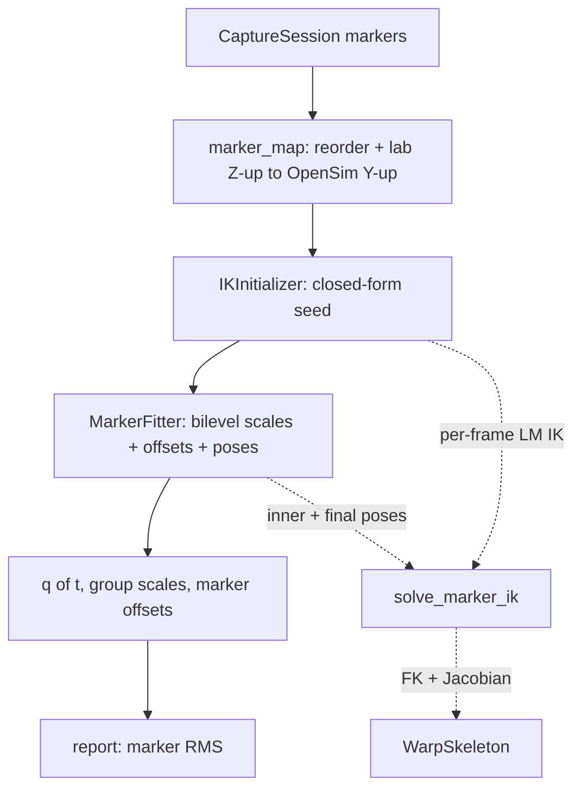

# 22 — Inverse kinematics process (marker fitting)

How `biomech` turns raw mocap marker trajectories into skeleton poses `q(t)` on the
OpenSim (Rajagopal-2015) model. This is the Windows-native, Warp-GPU-driven
re-implementation of Nimble's (nimblephysics/DART) full-body marker-fitting stack. For
the file-by-file Nimble → port map see `21_nimble_source_map.md`; for the porting
rationale see `20_nimble_port_plan.md`.

There are four layers, run bottom-up. Layer 0 is the differentiable engine; Layers 1–3
are the solver stack (per-frame IK → closed-form seed → bilevel fit). Real captures enter
through the marker bridge, and errors come out through the report module.

## Layer 0 — the differentiable skeleton (engine)

Everything sits on `WarpSkeleton` (`skeleton/skeleton.py`), which provides the two
quantities IK needs, both **batched over all frames at once**:

- **Forward kinematics** — `forward(q, group_scales)` (`skeleton.py:603`) launches two
  Warp kernels (`_fk_kernel`, `_marker_kernel`) and returns body transforms `(F, B, 4, 4)`
  and marker world positions `(F, M, 3)` in OpenSim's Y-up frame. Flows through OpenSim
  `SimmSpline` coupled DOFs exactly.
- **Marker Jacobian** `d(marker world pos)/dq`. Two backends:
  - `marker_jacobian_wrt_q` (`skeleton.py:707`) — exact Warp autodiff, `3*M` reverse
    passes but independent of frame count.
  - `marker_jacobian_wrt_q_fd` (`skeleton.py:792`) — the **default**: two GPU kernel
    launches doing central differences over `(frame, dof, sign)`. ~1–2 orders of magnitude
    faster, agrees with autodiff to ~1e-8.

The batching insight (`ik.py:10-15`): because the Jacobian sweep is independent of frame
count, IK over an entire trial costs essentially one FK + one Jacobian per iteration.

## Layer 1 — per-frame pose IK (core solver)

`solve_marker_ik` in `fitting/ik.py:120` — a batched **Levenberg–Marquardt** solver, port
of Nimble's `Skeleton::fitMarkersToWorldPositions` + `math::solveIK`/`refineIK`.

Given fixed `group_scales` and marker offsets, it finds the per-frame `q` that best
reprojects the observed markers:

1. Build per-`(frame, marker)` row weights `sqrt(weight) * mask`, with NaN observations
   auto-masked (`_row_weights`, `ik.py:92`; `ik.py:181-187`).
2. Each LM iteration (`ik.py:204-256`): compute residual `r = (FK(q) - obs) * w`, get the
   weighted Jacobian `J`, form the **normal equations** `H = JᵀJ`, `g = Jᵀr`, and solve
   `(H + λI) δ = g` batched over frames with `np.linalg.solve`.
   - Deliberate math choice (`ik.py:16-20`): Nimble's damped-least-squares form
     `Jᵀ(JJᵀ + λI)⁻¹r` is replaced by the algebraically-identical, cheaper `ndof×ndof`
     normal-equation form via the push-through identity.
3. Per-frame adaptive damping with accept/reject: accepted steps shrink `λ` (×0.5),
   rejected steps grow it (×4) and revert the pose (`ik.py:240-248`).
4. Poses clamped to joint limits from `position_limits` (`ik.py:69`), which respects
   locked/clamped OpenSim coordinates.
5. Converges when the accepted improvement is tiny or damping hits its ceiling on every
   frame.

Validated to machine precision by synthetic round-trip (noiseless recovery to ~1e-6 deg;
see `MEMORY.md`).

## Layer 2 — closed-form initializer (gradient-free seed)

`IKInitializer` in `fitting/ik_initializer.py` — port of Nimble's
`IKInitializer::runFullPipeline`. LM needs a good starting point; this produces one
without gradients. `run()` (`ik_initializer.py:440`) does three stages:

1. **Joint centers by MDS triangulation** — `closed_form_mds_joint_centers`
   (`ik_initializer.py:193`). For each frame/joint, builds a squared-distance matrix from
   adjacent visible markers + already-solved neighbor joint centers, reconstructs a point
   cloud (`closed_form.point_cloud_from_distance_matrix`), maps it onto the data (Kabsch),
   and resolves coplanar sign ambiguity against the neutral skeleton. Iterates within a
   frame so solved joints help triangulate the rest.
2. **Anisotropic group scales** — `estimate_group_scales` (`ik_initializer.py:294`), port
   of `estimateGroupScalesClosedForm`. Accumulates observed pairwise distances (joint
   centers + anatomical markers per body) across frames and fits per-body scale via
   `closed_form.get_local_scale`, condensing into the symmetric group-scale vector. Seeded
   by an isotropic **prescale** (`estimate_prescale`, `ik_initializer.py:258`) — the robust
   median of observed/model anatomical-marker distance ratios — for weakly-observed axes.
3. **Poses** — `estimate_poses` (`ik_initializer.py:401`) seeds root translation from the
   root joint center, then calls `solve_marker_ik` (Layer 1).

Deferred Nimble polishing (pivot-finding, axis-recenter) is noted at
`ik_initializer.py:22-25`.

## Layer 3 — bilevel marker fit (scales + offsets + poses)

`MarkerFitter` in `fitting/marker_fitter.py` — port of Nimble's `MarkerFitter.cpp`. Nimble
uses IPOPT (unavailable on Windows), so this replaces the optimizer with **block-coordinate
descent** where each block is exact or a proper descent step (`marker_fitter.py:3-25`).
`fit()` (`marker_fitter.py:212`) loops:

1. **Poses** — inner LM IK via `solve_marker_ik` (exact given scales/offsets).
2. **Marker offsets** — `_offset_update` (`marker_fitter.py:151`): closed-form per-marker
   3×3 least squares (diagonal because rotations are orthonormal), regularized toward the
   model's `.osim` offsets by a quadratic prior (anatomical markers anchored 25× harder),
   with a clamp on offset magnitude.
3. **Group scales** — `_scale_step` (`marker_fitter.py:184`): one Gauss–Newton/LM step
   using a finite-difference scale Jacobian (`3G` columns), plus a weak Tikhonov pull
   toward neutral / an optional anthropometric target.

Holding poses fixed while updating scales/offsets is valid at the inner-IK optimum by the
envelope theorem (`marker_fitter.py:20`). The offset prior resolves the
scale/offset/pose gauge ambiguity.

## End-to-end orchestration & real-data bridge

`contact/pipeline.py:reconstruct_window` (`pipeline.py:104`) shows the full flow: map
captured markers → run `IKInitializer` for a seed → run `MarkerFitter` for
`{scales, offsets, poses}`.

The bridge that feeds real captures is `fitting/marker_map.py`:
`observations_from_session` maps Vicon Plug-in-Gait labels (S001 capture) into
Rajagopal-2015 marker order, produces the `(F, M, 3)` NaN-gapped array the fitters expect,
and rotates lab **Z-up → OpenSim Y-up** (`R_PM2OS`, `marker_map.py:31`) so the fitted `q`
lands in the canonical OpenSim frame. `anatomical_mask` flags the bony landmarks used for
scaling.

## Reporting

`fitting/report.py` (`marker_errors`) computes overall/per-frame/per-marker RMS via Warp
FK. On S001 real data, median marker RMS is ~16.6 mm — dominated by the PiG↔Rajagopal
marker-set mismatch and soft-tissue artifact on thigh/shank cluster markers, not the solver
(see `MEMORY.md` and `21_nimble_source_map.md`).

## Key references

| Concern | File / symbol |
|---|---|
| Per-frame LM IK | `fitting/ik.py:120` `solve_marker_ik` |
| Closed-form seed | `fitting/ik_initializer.py:440` `IKInitializer.run` |
| Bilevel scale/offset/pose | `fitting/marker_fitter.py:212` `MarkerFitter.fit` |
| FK + Jacobian engine | `skeleton/skeleton.py:603` / `:792` |
| Real-data marker bridge | `fitting/marker_map.py:172` |
| End-to-end orchestration | `contact/pipeline.py:104` |
| Marker error reporting | `fitting/report.py` `marker_errors` |
| Nimble source mapping | `20_nimble_port_plan.md`, `21_nimble_source_map.md` |
| Status / validation notes | `MEMORY.md` |

Nimble originals ported: `Skeleton::fitMarkersToWorldPositions` + `math::solveIK` →
`ik.py`; `IKInitializer.cpp` → `ik_initializer.py`; `MarkerFitter.cpp` →
`marker_fitter.py`.
